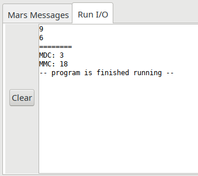
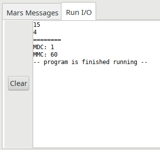
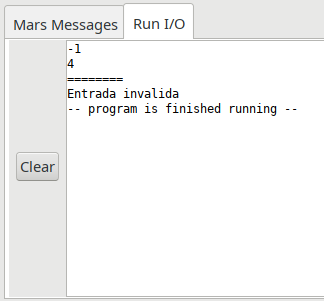

# Introdução

&emsp;&emsp; A disciplina de Fundamentos de Arquitetura de Computadores trata de diversos tópicos que nos
ajudam a compreender como sistemas eletrônicos de computação são construídos. Esse tipo de
conhecimento ajudará profissionais de áreas afetas a tecnologias de informação e comunicação a
aplicarem, adequadamente, um computador digital na realização de tarefas que, devido à sua
natureza, serão melhores conduzidas por um sistema automatizado.

&emsp;&emsp;Além de identificar a conveniência da aplicação dos computadores digitais, a disciplina ajudará a
desenvolver competências necessárias para a solução de problemas em sistemas computacionais em
operação, principalmente problemas decorrentes de análise de desempenho

# Objetivo
> 1) Exercitar conceitos da linguagem de montagem (assembly) MIPS.
> 2) Interagir com ferramentas de desenvolvimento para criação, gerenciamento, depuração e testes
de projeto de aplicações.

<!-- ## Desenvolvimento

&emsp;&emsp; A solução foi desenvolvida em assembly Mips utilizando a plataforma de compilação Mars4.5 a solução da dupla está explicitada nas imagens abaixo :

 -->

## Como Usar:

&emsp;&emsp; Para usar este software, basta seguir os passos abaixo:

1. Compilar e executar o código fornecido
2. digitar 2 números **inteiros e maiores do que 1** no terminal, apertando a tecla ENTER após digitar cada número

## Resultados

&emsp;&emsp; Os resultados encontrados estão exibidos abaixo em imagens: 

- Caso de Teste 01

- Caso de Teste 02

- Caso de Teste de Número Inválido

## Referências Teóricas

> David A. Patterson; John Hennessy, Organização e Projeto de Computadores, Campus, 3a Edição, 2005.

> Material disponibilizado pelo professor, Tiago Alves da Fonseca, da Universidade de Brasília

## Autores
- Diego Barbosa da Mota França, 14/0136355
- Romeu Carvalho Antunes, 15/0147554
